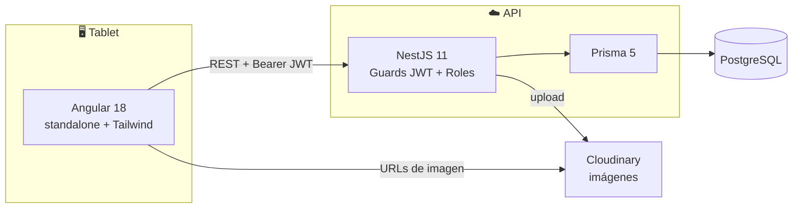

<div align="center">

# 🍦 helados-app

**Aplicación web interna para la operación diaria de una startup de helados.**

Pedidos, catálogo, inventario, cupones y analíticas — pensada para usarse desde una tablet en horizontal.

<p>
  
  
  
  
  
  
</p>

</div>

---

## 📋 Tabla de contenidos

- [Descripción general](#-descripción-general)
- [Arquitectura](#-arquitectura)
- [Stack tecnológico](#-stack-tecnológico)
- [Estructura del repositorio](#-estructura-del-repositorio)
- [Puesta en marcha](#-puesta-en-marcha)
- [Variables de entorno](#-variables-de-entorno)
- [Módulos y rutas de la API](#-módulos-y-rutas-de-la-api)
- [Rutas y vistas del frontend](#-rutas-y-vistas-del-frontend)
- [Modelo de datos](#-modelo-de-datos)
- [Pruebas](#-pruebas)
- [Flujo de desarrollo](#-flujo-de-desarrollo)
- [Despliegue](#-despliegue)
- [Seguridad](#-seguridad)

---

## 🎯 Descripción general

`helados-app` la usa el personal (4–5 personas) desde una **tablet en orientación horizontal**.
No es una app de cara al público: se prioriza la simplicidad y la comodidad táctil sobre una UX compleja.

| | Funcionalidad |
|---|---|
| 🧾 | **Toma de pedidos** en un flujo visual de 5 pasos: producto → sabor → toppings → cupón → revisión y pago |
| 💳 | **Pagos divididos**: hasta dos métodos (efectivo y QR) por pedido |
| 🚫 | **Anulación de pedidos**: el staff corrige un error dentro de 15 min, el admin sin límite; los anulados dejan de contar en las cifras |
| 🍨 | **Catálogo** de productos, sabores y toppings administrable por el rol ADMIN |
| 📦 | **Inventario** con snapshots de mañana/noche y registro de auditoría de ediciones |
| 🎟️ | **Cupones** de descuento porcentual o fijo, con validación en tiempo real |
| 📊 | **Analíticas**: ingresos, ítems más vendidos, análisis por día y comparación entre días |
| 💰 | **Conciliación de caja**: contrasta lo registrado por el sistema con el efectivo y QR reales |

**Roles:** `STAFF` toma pedidos y consulta el historial; `ADMIN` además administra catálogo, usuarios, cupones, inventario y analíticas.

---

## 🏗️ Arquitectura



**Autorización en dos capas:**

- `@UseGuards(JwtAuthGuard)` a nivel de clase → cualquier usuario autenticado.
- `@UseGuards(RolesGuard) @Roles('ADMIN')` a nivel de método → solo ADMIN.

El personal necesita **leer** el catálogo para tomar pedidos, así que los `GET` de productos,
sabores y toppings están abiertos a cualquier usuario autenticado, mientras que las
escrituras (`POST` / `PATCH`) quedan restringidas a ADMIN.

---

## 🧱 Stack tecnológico

| Capa | Tecnología |
|---|---|
| Frontend | Angular 18 (componentes standalone, rutas *lazy*), Tailwind CSS |
| Backend | NestJS 11 + Prisma 5 + PostgreSQL |
| Imágenes | Cloudinary (capa gratuita) |
| Autenticación | JWT (expira en 8 h), almacenado en `localStorage` |
| Desarrollo local | Docker Compose |
| Despliegue | Neon (PostgreSQL), Railway (API), Vercel o Netlify (Angular estático) |

---

## 📂 Estructura del repositorio

```
helados-app/
├── helados-api/            # API NestJS + Prisma
│   ├── prisma/             # schema.prisma, migraciones y seed
│   └── src/                # un módulo por dominio (auth, orders, analytics…)
├── helados-ui/             # Frontend Angular
│   └── src/app/
│       ├── core/           # guards, interceptors, models, services
│       ├── features/       # una carpeta por pantalla
│       └── shared/         # componentes reutilizables
├── docs/superpowers/       # specs y planes de desarrollo
├── docker-compose.yml      # PostgreSQL + API + UI para local
└── CLAUDE.md               # contexto del proyecto para asistencia con IA
```

---

## 🚀 Puesta en marcha

### Requisitos previos

- **Node.js 20+** y **npm**
- **Docker** y **Docker Compose**

### 1. Configurar las variables de entorno

```bash
cp .env.example .env                          # variables de docker-compose
cp helados-api/.env.example helados-api/.env  # configuración de la API
```

Edita ambos archivos y rellena los valores. Ninguno de los dos se sube al repositorio.

### 2. Levantar la base de datos

```bash
docker-compose up -d postgres
```

> 💡 `docker-compose up -d` sin argumentos levanta también la API y la UI en contenedores.

### 3. API

```bash
cd helados-api
npm install
npm run prisma:migrate   # aplica las migraciones
npm run prisma:seed      # crea el usuario admin y la configuración inicial
npm run start:dev        # → http://localhost:3000
```

### 4. UI

```bash
cd helados-ui
npm install
npx ng serve             # → http://localhost:4200
```

Inicia sesión con las credenciales que definiste en `SEED_ADMIN_EMAIL` / `SEED_ADMIN_PASSWORD`.

---

## 🔐 Variables de entorno

Los archivos `.env` están en `.gitignore`. Usa las plantillas `.env.example` como referencia.

**Raíz del repositorio** (`docker-compose.yml`):

| Variable | Descripción |
|---|---|
| `POSTGRES_USER` | Usuario de la base de datos local |
| `POSTGRES_PASSWORD` | Contraseña de la base de datos local |
| `POSTGRES_DB` | Nombre de la base de datos (por defecto `helados_dev`) |
| `JWT_SECRET` | Secreto de firma de los tokens |

**`helados-api/.env`:**

| Variable | Descripción |
|---|---|
| `DATABASE_URL` | Cadena de conexión a PostgreSQL |
| `JWT_SECRET` | Secreto de firma de los tokens — genera uno con `openssl rand -base64 32` |
| `PORT` | Puerto de la API (por defecto `3000`) |
| `FRONTEND_URL` | Origen permitido por CORS (por defecto `http://localhost:4200`) |
| `CLOUDINARY_CLOUD_NAME` · `CLOUDINARY_API_KEY` · `CLOUDINARY_API_SECRET` | Credenciales de Cloudinary |
| `SEED_ADMIN_EMAIL` · `SEED_ADMIN_PASSWORD` | Usuario administrador que crea el seed |

> ⚠️ El seed **falla a propósito** si `SEED_ADMIN_PASSWORD` no está definida: así ninguna
> contraseña por defecto queda escrita en el código.

El frontend lee la URL de la API desde `helados-ui/src/environments/environment.ts`
(y `environment.prod.ts` para producción). **No** usa `VITE_API_URL`.

---

## 🧩 Módulos y rutas de la API

| Módulo | Rutas principales | Acceso |
|---|---|---|
| **Auth** | `POST /auth/login` · `POST /auth/change-password` | público · autenticado |
| **Users** | `GET/POST /users` · `PATCH /users/:id/role` · `PATCH /users/:id/deactivate` | ADMIN |
| **Products** | `GET /products` · `POST /products` · `PATCH /products/:id` · `PATCH /products/:id/toggle-active` | lectura autenticada · escritura ADMIN |
| **Flavors** | `GET /flavors` + escrituras | lectura autenticada · escritura ADMIN |
| **Toppings** | `GET /toppings` · `GET /toppings/type-config` · `PATCH /toppings/type-config/:type` | lectura autenticada · escritura ADMIN |
| **Coupons** | `POST /coupons/validate` · CRUD | validación autenticada · resto ADMIN |
| **Images** | `POST /images/upload` (límite 5 MB, sube a Cloudinary) | ADMIN |
| **Orders** | `POST /orders` · `GET /orders` · `GET /orders/:id` · `PATCH /orders/:id/cancel` | autenticado |
| **Inventory** | `POST/GET /inventory/snapshots` · `GET /inventory/snapshots/day` · `PATCH /inventory/snapshots/:id` | ADMIN |
| **Analytics** | `GET /analytics/summary` · `/top-items` · `/reconciliation-summary` (rango `from`/`to`)<br>`GET /analytics/daily` · `/reconciliation` (`date`) · `PUT /analytics/reconciliation` | ADMIN |

**Detalles de comportamiento:**

- 📧 **Normalización de emails** — siempre `.toLowerCase()` antes de `findUnique` y `create`, porque PostgreSQL distingue mayúsculas de minúsculas.
- 🎟️ **Validación de cupones** — devuelve `422 Unprocessable Entity` (no 400) y los mensajes de error están en español.
- 💳 **Pagos divididos** — de 1 a 2 métodos por pedido, sin repetir; la suma debe cuadrar exactamente con el total (comparación en céntimos enteros) o se devuelve 422.
- 🍫 **Toppings incluidos** — cada producto puede incluir *N* toppings gratis de un tipo; los que excedan se cobran a precio completo. El frontend replica el cálculo para la vista previa del precio.
- 📦 **Snapshots de inventario** — `POST` funciona como *upsert* por (fecha, periodo) dentro de una transacción; `PATCH` reemplaza las líneas y añade una entrada al log de auditoría.

---

## 🖥️ Rutas y vistas del frontend

| Ruta | Guard | Propósito |
|---|---|---|
| `/login` | — | Inicio de sesión |
| `/orders/new` | `authGuard` | Flujo visual de pedido en 5 pasos |
| `/orders/history` | `authGuard` | Historial con filtro por rango de fechas |
| `/dashboard` | `authGuard` + `adminGuard` | Ingresos, top de ítems y conciliación de caja |
| `/dashboard/daily` | `authGuard` + `adminGuard` | Análisis diario y comparación entre dos días |
| `/inventory` | `authGuard` + `adminGuard` | Snapshots de mañana/noche con auditoría |
| `/catalog` | `authGuard` + `adminGuard` | Pestañas: Productos / Sabores / Toppings |
| `/coupons` | `authGuard` + `adminGuard` | Gestión de cupones |
| `/users` | `authGuard` + `adminGuard` | Gestión de usuarios |

**Convenciones de Angular usadas en el proyecto:**

- Inyección de dependencias con la función `inject()` (sin inyección por constructor).
- Interceptor funcional (`HttpInterceptorFn`): añade el Bearer JWT; en 401 llama a `auth.logout()`, en 403 redirige a `/orders/new`.
- Guards funcionales (`CanActivateFn`): `authGuard` (sesión iniciada) y `adminGuard` (rol ADMIN).
- Tema oscuro: fondos `gray-950`, tarjetas `gray-900`; morado de marca `purple-600` / `purple-700`.

---

## 🗃️ Modelo de datos

Enums principales: `Role` · `ProductType` (CONE, CONTAINER, BEVERAGE) · `ProductSize` (SMALL, MEDIUM, LARGE, OZ4–OZ8) · `DiscountType` · `ToppingType` (NORMAL, PREMIUM) · `SnapshotPeriod` (MORNING, NIGHT) · `PaymentMethod` (QR, CASH).

| Modelo | Notas |
|---|---|
| `User` | email único, `passwordHash` con bcrypt, rol y estado activo |
| `Product` | tipo, tamaño, precio base, venta directa y toppings incluidos |
| `Flavor` · `Topping` | catálogo con imagen y modificador/precio unitario |
| `ToppingTypeConfig` | precio por defecto de cada tipo de topping |
| `Coupon` | código único, tipo y valor de descuento, vigencia y usos |
| `Order` · `OrderPayment` | pedido con 1–2 pagos asociados |
| `OrderItem` · `OrderItemTopping` | líneas del pedido; guarda `unitPriceAtSale` como *snapshot* de precio |
| `InventorySnapshot` · `InventoryLine` · `InventoryEdit` | conteo por periodo y su log de auditoría |
| `DailyReconciliation` | efectivo y QR realmente contados por día |

> 💵 Todos los importes son `Decimal(10,2)`: Prisma devuelve objetos `Decimal`, así que hay que envolverlos en `Number(...)` antes de operar.

---

## 🧪 Pruebas

```bash
cd helados-api
npm test                             # suite completa (Jest)
npm test -- orders.service.spec.ts   # un archivo concreto
npm test -- -t "nombre del caso"     # un test por nombre
npm run test:cov                     # con cobertura
npm run lint                         # ESLint con --fix
```

El frontend se valida con la build de Angular:

```bash
cd helados-ui && npx ng build --configuration=development
```

---

## 🔧 Flujo de desarrollo

- Las ramas de features usan git worktrees bajo `.worktrees/` (ignorado por git).
- Las especificaciones viven en `docs/superpowers/specs/` y los planes en `docs/superpowers/plans/`, con nombre `YYYY-MM-DD-<slug>.md`. Primero la spec, luego el plan, luego la implementación.
- Cada cambio pasa por: implementación → revisión de cumplimiento del spec → revisión de calidad de código → marcar como hecho.
- Los cambios de esquema se hacen con `npm run prisma:migrate` y las migraciones se commitean.

---

## ☁️ Despliegue

| Componente | Servicio |
|---|---|
| Base de datos PostgreSQL | Neon |
| API NestJS | Railway |
| Frontend Angular (estático) | Vercel o Netlify |

En el entorno de despliegue hay que definir `DATABASE_URL`, un `JWT_SECRET` propio,
`FRONTEND_URL` con el dominio real y las credenciales de Cloudinary.

---

## 🔒 Seguridad

- Ningún archivo `.env` se versiona; solo se publican plantillas `.env.example` sin valores.
- Las contraseñas se almacenan con bcrypt.
- CORS restringido al origen definido en `FRONTEND_URL`.
- El `ValidationPipe` global usa `whitelist: true`: las propiedades no declaradas en los DTO se descartan.

Si encuentras un problema de seguridad, abre un *issue* sin incluir datos sensibles.

---

## 📄 Licencia

Proyecto interno privado. Todos los derechos reservados.
